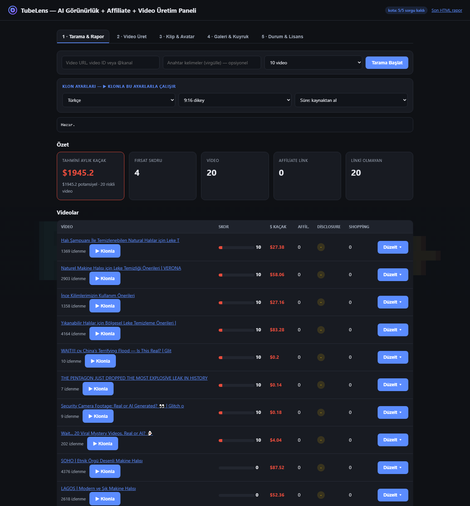
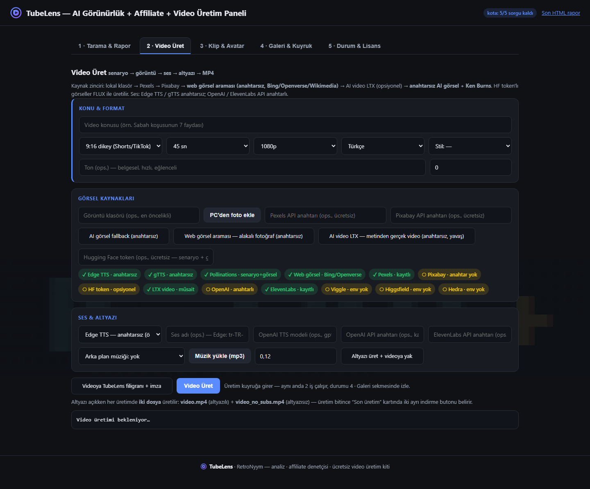
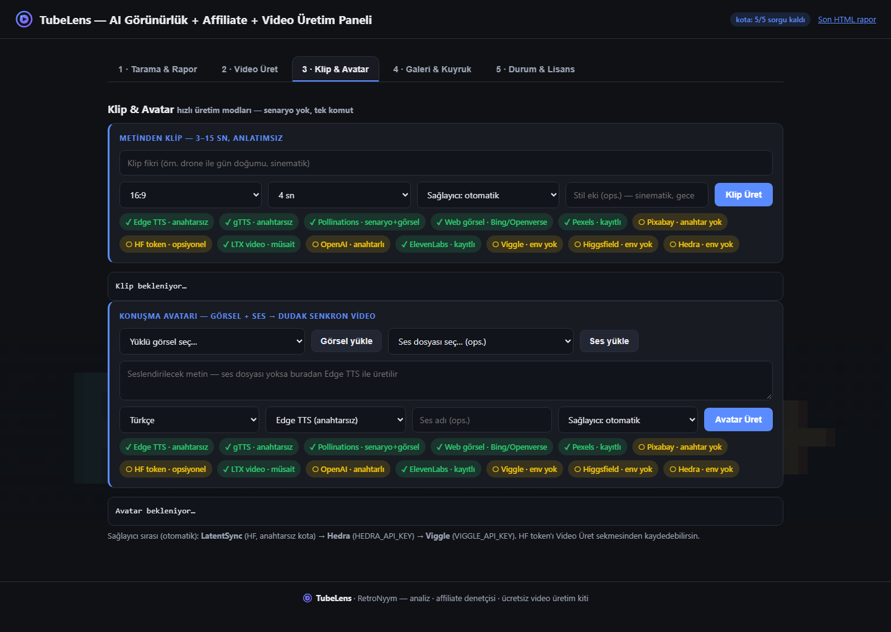
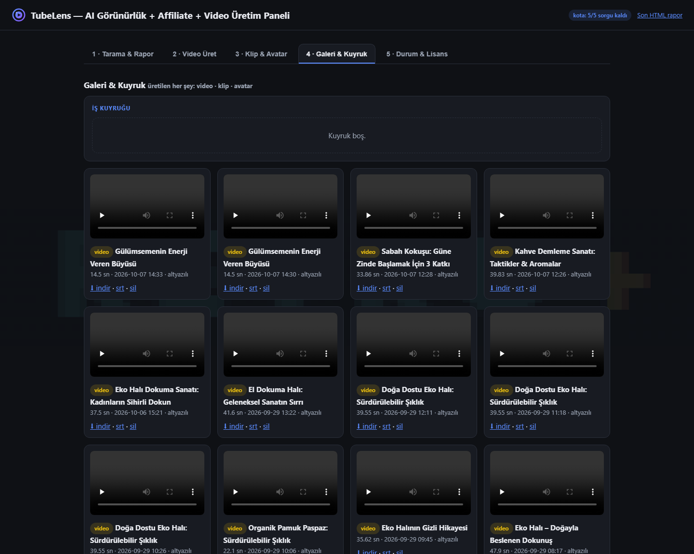
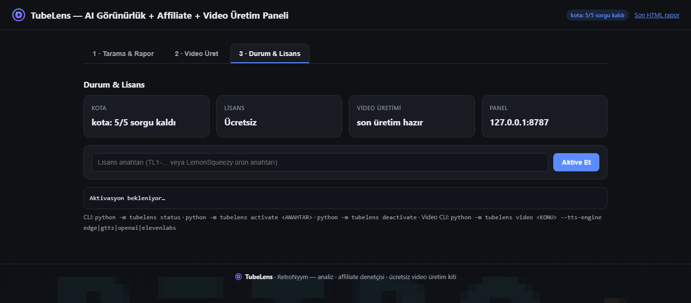

# TubeLens — YouTube AI Visibility & Affiliate Audit + Keyless Video Generator

[](LICENSE)
[](requirements.txt)
[](https://github.com/RetroNyym/tubelens/actions/workflows/ci.yml)
[](#ücretsiz-plan-ve-lisans-freemium)
[](#özellikler)

> **EN:** YouTube AI-visibility checker (Google AI Overviews, YouTube AI summaries,
> Bing Copilot, DuckDuckGo AI Chat) + affiliate / YouTube Shopping audit —
> **no API key required**. Plus a **keyless video generator** (script → stock &
> web image search → TTS → subtitles → FFmpeg), **text-to-video clips** and
> **talking avatar** mode, all from one local dashboard.

**YouTube AI arama görünürlüğü + affiliate gelir denetçisi.**
Tek komutla bir videonun ya da kanalın: yapay zekâ özetlerinde görüp görünmediğini,
4 arama motorundaki sırasını, affiliate link / disclosure / YouTube Shopping eksiklerini
ve kaçırılan gelir fırsatlarını gösterir.

**Ayrıca** anahtarsız **video üretim kiti** ile konudan bitmiş MP4 üretir
(senaryo → görüntü [stok + **web görsel araması** + ops. AI video] → seslendirme
→ altyazı → montaj), panelden tek tuşla — yanında **klip** (metinden anlatımsız
3–15 sn) ve **konuşma avatarı** (görsel + ses) modları da var.

> **Neden bu araç?** 2026'da YouTube trafiğinin büyük kısmı Google AI Overviews,
> YouTube'un kendi AI özeti, Bing Copilot ve DuckDuckGo AI Chat üzerinden geliyor.
> "Video kaçırıyor mu?" sorusuna yanıt veren, bunu API anahtarı olmadan yapan ve
> affiliate tarafını da kontrol eden bir araç pazarda neredeyse yok.

**İçindekiler:**
[Ekran Görüntüleri](#ekran-görüntüleri) ·
[Özellikler](#özellikler) ·
[Kurulum](#kurulum) ·
[Kullanım](#kullanım) ·
[Ücretsiz plan ve lisans](#ücretsiz-plan-ve-lisans-freemium) ·
[Nasıl çalışıyor?](#nasıl-çalışıyor) ·
[Güncellemeler](#güncellemeler) ·
[Yol haritası](#yol-haritası)

---

## Ekran Görüntüleri

**1 · Tarama & Rapor** — AI görünürlük tablosu, $ kaçak özeti, klon ayarları,
`▶ Klonla` / `Düzelt ▾` aksiyonları:



**2 · Video Üret** — gruplu üretim formu (Konu & Format · Görsel Kaynakları ·
Ses & Altyazı; stil preset'leri, arka plan müziği, altyazı anahtarı), sağlayıcı
rozetleri ve `video.mp4` (altyazılı) + `video_no_subs.mp4` (altyazısız) +
`subtitles.srt` indirme butonlarıyla "Son üretim" kartı:



**3 · Klip & Avatar** — hızlı üretim modları: metinden anlatımsız klip
(sağlayıcı seçimi) ve görsel + ses ile dudak senkron konuşma avatarı:



**4 · Galeri & Kuyruk** — iş kuyruğu (aynı anda 2 iş) + üretilen her şeyin
galerisi (video · klip · avatar; oynat, indir, srt, sil):



**5 · Durum & Lisans** — kota, lisans aktivasyonu/kaldırma, lisans detayı,
işlem günlüğü, sağlayıcı durumu ve CLI komut referansı:



---

## Özellikler

### 1) AI arama görünürlüğü takibi — AI visibility checker (Google AI Overviews · YouTube AI · Bing Copilot · DuckDuckGo)
Anahtar kelimeyi 4 motor üzerinden sorgular ve videonun nerede göründüğünü puanlar:

| Motor | Ağırlık | Ne ölçülür |
|---|---|---|
| Google | 0.35 | Organik sıralama + AI Overview içinde var mı |
| YouTube  | 0.30 | Sıralama + **sonucun kendi AI özeti** + başka videonun AI özeti metninde geçme |
| Bing | 0.20 | Sıralama + Copilot/AI kutusu |
| DuckDuckGo | 0.15 | Sıralama + AI Chat sonucu |

- `+AI` rozeti: sonucun AI özet kutusunda da göründüğünü gösterir.
- `in_ai_text`: videonun başlığı *başka* bir videonun AI özeti metninde geçiyor mu
  (yani rakip videonun AI kaynağı olup olmadığınız).
- Bot koruması / JS zorunluluğu olan motorlar **"bulundu" yerine dürüstçe `hata` döner**
  ve ağırlık çalışan motorlara kayar — yanıltıcı "0 sonuç" vermez.

### 2) Affiliate & YouTube Shopping denetçisi — affiliate link checker / disclosure audit
Her video için:
- Açıklamadaki linkler → affiliate tespiti (Amazon, Trendyol, Havuz, Impact, cdiscount …)
- Reklam/sponsor **disclosure** var mı (YouTube politika riski)
- YouTube Shopping ürün etiketi var mı
- Açıklama uzunluğu, spam sinyalleri, konuya uygun program önerileri

Sonuçta **0-100 gelir fırsat skoru** ve "şu videoya şunu ekle" şeklinde öncelikli
fırsat listesi üretilir. Yanında **$ kaçak tahmini** da var (aşağıda bkz. özellik 5).

### 3) TubeLens Video Kit — anahtarsız video üretim kiti (keyless AI video generator)

MoneyPrinterTurbo tarzı, **kendi kitimiz** olarak doğrudan CLI'ye gömülü tam video
üretim hattı. Tek komutla konudan bitmiş MP4'e:

- **Senaryo** → anahtarsız Pollinations LLM (hook, anlatım, SEO başlık/açıklama/etiket + İngilizce stok görüntü kelimeleri)
- **Görüntü** → altı kademeli kaynak zinciri (ilk elenen geçer, **hiçbirinde anahtar yoksa bile üretilir**):

  | Sıra | Kaynak | Anahtar |
  |---|---|---|
  | 1 | `--footage-dir` kendi görüntüleriniz | gerekmez |
  | 2 | Pexels API | ücretsiz |
  | 3 | Pixabay API | ücretsiz |
  | 4 | **Web görsel araması** — Bing/Openverse/Wikimedia'dan alakalı gerçek fotoğraf (`--no-web-images` ile kapatılır) | **yok** |
  | 5 | **AI video LTX** — metinden gerçek video klibi (`--ltx-video`, Hugging Face Spaces; `--hf-token` ile kota genişler) | ops. (HF token) |
  | 6 | **Pollinations AI görsel + Ken Burns** (anahtarsız) | **yok** |

  Panelde Video Üret sekmesinde de **"Web görsel araması"** ve **"AI video LTX"**
  onay kutuları + "Hugging Face token" alanı vardır.

- **Seslendirme** → 4 motor (`--tts-engine`):

  | Motor | Anahtar | Kelime zamanlaması |
  |---|---|---|
  | `edge` (varsayılan) | **yok** | gerçek (WordBoundary) |
  | `gtts` | **yok** | tahmini (orantılı) |
  | `openai` | OpenAI API | tahmini (orantılı) |
  | `elevenlabs` | ElevenLabs API | **gerçek** (karakter bazlı) |

- **Altyazı** → kelime bazlı zamanlamadan SRT + videoya yakma (libass)
- **Montaj** → FFmpeg: hedef çözünürlüğe indirme (cover-crop), klip birleştirme, ses kalibrasyonu, opsiyonel arka plan müziği, `+faststart`

Çıktı klasöründe: `video.mp4`, `script.json` / `script.txt`, `audio.mp3`,
`subtitles.srt` ve YouTube'a yükleme için hazır `meta.json` (başlık/açıklama/etiketler).

> **Marka imzası:** her video sağ üst köşede yarı saydam **TubeLens filigranı** taşır
> ve `meta.json` açıklamasının sonuna "— TubeLens ile üretildi" satırı eklenir
> (`--no-logo` ile kapatılır; panelde Video Üret sekmesindeki onay kutusu).

> **Ücretsiz ve anahtarsız:** senaryo + TTS (edge/gtts) + altyazı + montaj + AI görsel
> + **web görsel araması** tamamen anahtarsız çalışır. Pexels/Pixabay anahtarları
> isteğe bağlı hız/kalite artışıdır; LTX AI video da anahtarsız çalışır (HF token
> ile kota genişler); OpenAI/ElevenLabs yalnızca daha iyi ses isteyenler içindir.

### 4) Kazananı Klonla — Tarama → Üretim hattı (clone competitor script, rakiplerde yok)

Tarama tablosundaki her videonun yanındaki **`▶ Klonla`** butonu:

1. Kaynak videonun **transkriptini** (kapalıysa başlık+açıklamayı) çeker,
2. LLM ile videonun **yapısını** (hook, akış, tempo) analiz edip **aynı yapıda
   özgün senaryo** üretir — birebir kopya prompt'ta yasaklanmıştır (%30 farklı açı),
3. Senaryo `data/clone_draft.json`'a yazılır, panel Video formunu **otomatik doldurur**,
4. `Video Üret`e bastığında senaryo **dosyadan okunur** (LLM tekrar çalışmaz).

```bash
# CLI karşılığı
python -m tubelens clone "https://www.youtube.com/watch?v=VIDEO_ID"
python -m tubelens video --script-file data/clone_draft.json
```

> "Rakibin en çok izlenen videosunu bul → 3 dakikada kendi versiyonunu üret" hattı.
> Kota harcamaz (Pollinations anahtarsız); YouTube API anahtarı gerekmez.

### 5) Gelir Kaçak $ Paneli — skor değil, para (revenue leak calculator)

Skorlar ikna etmez; **para rakamı** eder. Tarama sonrası:

- **"Tahmini aylık kaçak: $X"** kartı — izlenme × affiliate tıklama oranı × konu/komisyon endeksi;
  affiliate/shopping/eksik açıklama payları ayrı ayrı $ olarak kırılır
  (affiliate %60, shopping etiketi %25, kısa açıklama %10),
- Tabloda video bazlı **$ Kaçak** sütunu,
- Her videoda **`Düzelt ▾`** → eksik için hazır reçete: disclosure metni, program önerisi,
  Studio etiketleme adımları, açıklama iskeleti — hepsi **`Panoya kopyala`** ile tek tık,
- HTML raporda aynı kart + "Hazır Düzeltme Reçeteleri" bölümü.

> Hesaplama deterministiktir, **kota harcamaz**. Endeksler `shopping.py`'de
> (`_EARN_PER_CLICK`, `_AFFILIATE_CTR`) düzenlenebilir.

---

## Kurulum

```bash
git clone https://github.com/RetroNyym/tubelens.git
cd tubelens
python -m venv .venv
.venv\Scripts\activate        # Windows — Linux/macOS: source .venv/bin/activate
pip install -e ".[dev]"        # `tubelens` komutunu da kurar + pytest (alternatif: -r requirements.txt)

# doğrulama + testler (offline, ~5 sn)
tubelens --version
python -m pytest
```

Gereksinim: **Python 3.11+**, internet erişimi. YouTube Data API anahtarı **gerekmez**.
Video kiti için de anahtar gerekmez (ffmpeg `imageio-ffmpeg` ile otomatik gelir).

### Tek dosya exe (Windows · kurulum gerektirmez)

GitHub Releases'tan **`TubeLens.exe`** indir → masaüstüne koy → **çift tıkla**:

- Panel otomatik açılır, tarayıcıda arayüz gelir (Tarama · Video Üret · Lisans sekmeleri)
- Panel zaten açıksa ikinci tıklama mevcut oturumu tarayıcıda gösterir
- Veriler `%LOCALAPPDATA%\TubeLens` altına yazılır (Program Files'a gerek yok)
- CLI da aynı exe'den: `TubeLens.exe video "konu"` · `TubeLens.exe scan @kanal`
- Gereksinim: internet (senaryo/LLM + seslendirme + görsel kaynakları)

Kendi exe'nizi üretmek için:

```bash
pip install pyinstaller
pyinstaller tubelens.spec        # -> dist/TubeLens.exe (~84 MB, onefile + ikon)
```

---

## Kullanım

```bash
# Tek video: affiliate + shopping denetimi
python -m tubelens scan "https://www.youtube.com/watch?v=dQw4w9WgXcQ"

# Kanalın son videolarını tara
python -m tubelens scan "@mkbhd" --limit 10

# AI görünürlük kontrolü (her anahtar kelime 1 sorgu harcar)
python -m tubelens scan "@mkbhd" --limit 5 --keywords "en iyi bütçe laptop 2026, iphone 18 inceleme"

# Kayıtlı veriden HTML rapor üret
python -m tubelens report

# KAZANANI KLONLA: rakip videonun yapısını özgün senaryoya çevir
python -m tubelens clone "https://www.youtube.com/watch?v=VIDEO_ID"
python -m tubelens video --script-file data/clone_draft.json   # senaryo dosyadan (LLM atlanır)

# Yerel panel (tarayıcıda açılır) — 5 sekmeli: Tarama & Rapor | Video Üret |
# Klip & Avatar | Galeri & Kuyruk | Durum & Lisans
python -m tubelens panel

# Video Kit: konudan bitmiş videoya (senaryo + görüntü + ses + altyazı)
python -m tubelens video "Sabah koşusunun 7 faydası"

# Stil preset'i: sinematik / anime / 2d / 3d / minimal / belgesel
python -m tubelens video "Konu" --preset sinematik

# 4:3 ve 3:4 dahil 5 format: 9:16 | 16:9 | 1:1 | 4:3 | 3:4
python -m tubelens video "Konu" --aspect 4:3 --resolution 720

# Metinden anlatımsız klip (3–15 sn) — senaryo yok, tek komut
python -m tubelens klip "drone ile gün doğumu, sinematik" --aspect 16:9 --duration 4

# Görsel + ses ile dudak senkron konuşma avatarı (ses yoksa metinden Edge TTS)
python -m tubelens avatar --image kisi.png --text "Merhaba, kanalıma hoş geldiniz" --lang tr

# Sadece senaryo üret (YouTube başlık/açıklama/etiketler dahil)
python -m tubelens video "Yapay zeka nedir" --script-only

# Anahtarsız tam üretim: AI görsel (Ken Burns) + Google gTTS seslendirme
python -m tubelens video "Gülümsemenin enerji veren etkisi" --tts-engine gtts

# ElevenLabs ile profesyonel ses + gerçek kelime zamanlaması
python -m tubelens video "Kahve demleme sırları" --tts-engine elevenlabs --elevenlabs-key ANAHTAR

# Pixabay + Pexels anahtarlarıyla stok görüntüler, yatay 720p
python -m tubelens video "Kahve demleme" --aspect 16:9 --resolution 720 \
  --footage-dir "C:\footage" --pixabay-key PIX_KEY --bgm music.mp3

# Pexels/Pixabay anahtarını bir kez kaydet (ücretsiz: pexels.com/api · pixabay.com/api/docs)
python -m tubelens video "konu" --pexels-key PTL_ANAHTAR --pixabay-key PBX_ANAHTAR

# Web görsel araması + LTX AI video (anahtarsız; HF token kota açar)
python -m tubelens video "Vahşi doğada çadır kurmak" --ltx-video --hf-token HF_TOKEN

# Web görsel aramasını kapat, sadece lokal + Pexels/Pixabay + AI görsel zinciri
python -m tubelens video "konu" --no-web-images
```

- **CLI:** çıktı `reports/report_*.html` dosyasına yazılır.
- **Panel:** `http://127.0.0.1:8787` — **5 sekme**: *Tarama & Rapor* (analiz
  tabloları + klon ayarları), *Video Üret* (gruplu üretim formu; **klon taslağı
  geldiğinde form otomatik dolar**), *Klip & Avatar* (hızlı üretim modları),
  *Galeri & Kuyruk* (iş kuyruğu + üretim galerisi), *Durum & Lisans*
  (kota, aktivasyon/kaldırma, rapor yeniden üretim, sağlayıcı durumu).
  Tarama sekmesinde **`▶ Klonla`** butonu ve
  **$ kaçak** sütunu + satır açılır **`Düzelt ▾`** reçeteleri (Panoya kopyala) vardır.
  Üretilen video panelde oynatılır ve
  `/api/video/latest` adresinden indirilir (HTTP Range destekli, cache-bust'lu).
  Headless ortam için: `python -m tubelens panel --no-browser`.
- **Panel video API'si:** `POST /api/video` gövdesi:
  `{topic, lang, duration, aspect, resolution, preset, style, clips, footage_dir,
  pexels_key, pixabay_key, ai_visuals, web_images, ltx_video, hf_token, tts_engine,
  voice, tts_model, openai_key, elevenlabs_key, bgm, bgm_volume, subs,
  script_only, script_file}` → **kuyruğa alınır** (aynı anda 2 iş, geçmiş
  `/api/state` → `jobs`);
  ayrıca `POST /api/klip {prompt, …}`, `POST /api/avatar {image, audio|text, …}`,
  `GET /api/gallery`, `GET /api/audio`, `GET /api/bgm`;
  ilerleme `/api/state` → `video` alanında, son üretim `/api/video/latest` + `/api/video/srt`;
  klon: `POST /api/clone` `{url, lang, aspect, duration}` → `state.clone.draft`;
  lisans: `POST /api/activate` `{key}`, `POST /api/deactivate`, `POST /api/report`.
  Üretim ≈1–3 dk sürer.
- **Video Kit:** çıktı `videos/<zaman>-<slug>/` klasörüne yazılır; en son üretim
  `videos/` altında kalır, depoya girmez. `video --help` tüm seçenekleri listeler
  (`--lang`, `--duration`, `--aspect 9:16|16:9|1:1|4:3|3:4`, `--preset`,
  `--voice`, `--clips`, `--no-subs`, `--no-web-images`, `--ltx-video`,
  `--hf-token`, `--bgm-volume`, `--out` …);
  hızlı modlar: `klip --help`, `avatar --help`.

### Örnek çıktı (gerçek üretim)

```bash
python -m tubelens video "Gülüşü güzelleştiren 3 alışkanlık" --duration 15 --resolution 720
```

```
videos/panel-20260928-104745/
├── video.mp4        ← 19.3 sn, 9:16 @720p, H.264 + AAC, altyazılar videoya yakılmış
├── script.txt       ← seslendirme metni (konuşma dili)
├── script.json      ← sahne/kare yapısı + hook + CTA
├── audio.mp3        ← Edge TTS (tr-TR-ahmetNeural)
├── subtitles.srt    ← kelime bazlı zamanlanmış altyazı (6 cue)
└── meta.json        ← YouTube başlık/açıklama/etiketler + stok görüntü terimleri
```

- **Önizleme videosu (360p):** [examples/ornek-video/video-onizleme-360p.mp4](examples/ornek-video/video-onizleme-360p.mp4)
- **Metin örnekleri:** [examples/ornek-video/](examples/ornek-video/) — `meta.json`,
  `script.txt`, `subtitles.srt` gerçek çıktıdan alınmıştır.
- **Panel HTTP API örneği:** [examples/video-api.sh](examples/video-api.sh)

Örnek senaryo ve altyazı (üretimden, olduğu gibi):

> İlk 3 saniyede gülümsemeye hazır olun! Yeni 3 alışkanlıkla yüzünüzü aydınlatın.
>
> 1️⃣ Güneş ışığıyla dolu bir duş alın, 2️⃣ Çiçekli minik aksesuarlar takın,
> 3️⃣ Saçlarınızı doğal bir dokuya kavuşturun. Gülüşünüzü şimdi yükseltin!

```srt
1
00:00:00,050 --> 00:00:02,775
İlk 3 saniyede gülümsemeye hazır olun

2
00:00:03,650 --> 00:00:06,388
Yeni 3 alışkanlıkla yüzünüzü aydınlatın
```

Video hattının akışı:

```
konu ─▶ llm.py (Pollinations, anahtarsız · ops. HF router) ─▶ senaryo + YouTube SEO meta
          ├─▶ footage.py  (lokal → Pexels → Pixabay → web görsel araması
          │                → [LTX AI video] → AI görsel + Ken Burns) ─▶ klip .mp4'ler
          ├─▶ voice.py    (Edge TTS, anahtarsız)   ─▶ audio.mp3 + kelime zamanları
          └─▶ assemble.py (FFmpeg: scale/crop, concat, tpad, SRT yakma, mix)
                                    └─▶ video.mp4 + video_no_subs.mp4 + meta.json + subtitles.srt
```

---

## Ücretsiz plan ve lisans (Freemium)

| | Ücretsiz | Pro |
|---|---|---|
| Video / kanal tarama | ✅ sınırsız | ✅ sınırsız |
| Affiliate & shopping analizi | ✅ sınırsız | ✅ sınırsız |
| AI görünürlük sorgusu | **5 sorgu** | sınırsız |
| Rapor + panel | ✅ | ✅ |
| Video üretim kiti (senaryo + MP4) | ✅ sınırsız | ✅ sınırsız |

- **1 sorgu = 1 anahtar kelime.** `--keywords a,b,c` 3 sorgu harcar.
  Kaç video taradığınız hak yakmaz.
- Kalan hak az ise sistem ilk N kelimeyle çalışır ve uyarır; hak bittiyse
  AI adımı kilitlenir, video/affiliate analizi çalışmaya devam eder.
- Durum ve kota: `python -m tubelens status`

```bash
# Pro'ya geçiş — iki tür anahtar kabul edilir:
#  1) Ödeme sonrası verilen ürün anahtarı (LemonSqueezy, çevrimiçi doğrulanır)
python -m tubelens activate 38b1460a-5104-4067-a91d-77b872934d51
#  2) Yerel/dağıtım anahtarı (TL1-..., çevrimdışı, imza ile)
python -m tubelens activate TL1-xxxx-yyyy

python -m tubelens deactivate     # lisansı bu bilgisayardan kaldırır
python -m tubelens status         # kalan hak / lisans detayı
```

### Lisans nasıl doğrulanıyor?

| | Yerel anahtar (`TL1-…`) | Ürün anahtarı (LemonSqueezy) |
|---|---|---|
| Doğrulama | Çevrimdışı, HMAC-SHA256 imzası | Çevrimiçi License API (`activate` / `validate`) |
| Süre sınırı | Anahtarın içinde taşır | Paneldeki anahtar bitiş tarihi |
| Yeniden kontrol | Yok (imza yeterli) | En fazla **7 günde bir** tek istek |
| İnternet yoksa | Sorun yok | **30 günlük tolerans**; sonrası ücrete düşer |
| Kullanım hakkı | Sınırsız | Sınırsız (activation limiti varsa o kadar cihaz) |

- Doğrulama `tubelens/license.py` içindedir; `activate` yanıtı ve
  `activation_id` `data/quota.json`'a yazılır.
- API `expired` / `disabled` dönerse lisans otomatik düşer ve kullanıcı
  ücretsiz plana döner (sayaç yerinde kaldığı için 5 hakkı yeniden başlar).
- Kota dosyası elle silinirse sayaç sıfırlanır; **LemonSqueezy anahtarında bu
  işe yaramaz**, çünkü lisans sunucuda durur — asıl caydırıcılık ödeme
  entegrasyonundan gelir.

### Satıcı kurulumu (LemonSqueezy)

1. [LemonSqueezy](https://lemonsqueezy.com) hesabı aç → mağaza oluştur.
2. **Products → New product** → *Software license* tipini seç,
   *License key generation* açık olsun (limit/bitiş ayarlayabilirsin).
3. Müşteri ödeme yaptığında anahtar otomatik üretilir ve e-posta ile gider.
4. Anahtarı alan müşteri `python -m tubelens activate <ANAHTAR>` der —
   ek API anahtarı ya da webhook **gerekmez** (License API anahtarsız çalışır).
5. Panel/kota: `python -m tubelens keygen` ile dağıtım (yerel) anahtarı da
   üretebilirsin; ürün anahtarlarının tek avantajı sunucu tarafında iptal
   edilebilmesidir (`deactivate`, anahtar durumu *disabled*).

İsteğe bağlı: LemonSqueezy **webhook**'unu bir GitHub Action'a bağlayıp
satışları `data/` dışındaki bir kayıt defterine yazabilirsin; müşteri tarafında
zaten License API doğrulaması yapıldığı için bu zorunlu değildir.

### Toplu anahtar üretimi — müşteriye gönderim (satıcı)

```bash
# 100 adet 1 yıllık anahtar -> data/keys/satis-365gun.csv
python -m tubelens keygen --days 365 --count 100 --csv data/keys/satis-365gun.csv

# 20 adet sınırsız anahtar -> data/keys/satis-sinirsiz.csv
python -m tubelens keygen --days 0 --count 20 --csv data/keys/satis-sinirsiz.csv

# Tek anahtar (konsola basar)
python -m tubelens keygen --days 365
```

- **Akış:** satışta müşteriye CSV'den bir `TL1-…` anahtarı olduğu gibi gönderirsin;
  müşteri kendi makinesinde `python -m tubelens activate <ANAHTAR>` der.
  Anahtar **HMAC-SHA256 imzalıdır** — aktivasyon internet *istemz*, çevrimdışı
  doğrulanır; her anahtar tek cihazda aktifleşir (`deactivate` ile serbest kalır).
- **CSV sütunları:** `key, days, generated_at, status` — gönderdiğin anahtarın
  `status`'unu *sent/active* olarak güncelleyip satış takibi yapabilirsin.
- **Güvenlik:** `/data/keys/` `.gitignore`'dadır, anahtarlar depoya girmez.
  Sınırsız sayıda üretebilirsin; her üretim anında kendini doğrular.

---

## Nasıl çalışıyor?

YouTube Data API kotası ve anahtarı olmadan çalışır. HTML'deki gömülü JSON
(`ytInitialPlayerResponse`, `ytInitialData`) ayrıştırılır:

| Modül | Görev |
|---|---|
| `youtube.py` | Video/kanal/arama scraping, AI özeti sinyalleri, `lockupViewModel` & `videoRenderer` desteği |
| `search.py` | Google / YouTube / Bing / DDG kontrolü + ağırlıklı skor |
| `shopping.py` | Affiliate, disclosure, shopping etiketi analizi + fırsat skoru |
| `quota.py` | Freemium kota (5 sorgu) + lisans durumu |
| `license.py` | LemonSqueezy License API: activate / validate / deactivate, 7 gün yenileme, 30 gün tolerans |
| `report.py` | Tek dosya HTML rapor (`reports/latest.html`) |
| `panel.py` | 5 sekmeli HTTP paneli: tarama + kuyruklu üretim API'si (video/klip/avatar) + galeri + ses/müzik yükleme + lisans aktivasyon/kaldırma, oynatıcı/indirme (Range, streaming) |
| `cli.py` | `scan` / `report` / `panel` / `video` / `klip` / `avatar` / `status` / `activate` / `deactivate` / `keygen` (`--version`, `--preset`) |
| `storage.py` | `data/store.json` kayıt deposu (tarama geçmişi) |
| `llm.py` | Anahtarsız Pollinations LLM istemcisi + MPT tarzı senaryo üretici (JSON şema, cache-kırma retry) · ops. **HF router** (`openai/gpt-oss-120b`, `--hf-token`) |
| `footage.py` | Görüntü kaynak zinciri: lokal → Pexels → Pixabay → **web görsel araması (anahtarsız)** → **LTX AI video (ops.)** → **AI görsel (HF FLUX token'lı önce → Pollinations + Ken Burns, anahtarsız)** |
| `webimg.py` | Anahtarsız web görsel araması: Bing → Openverse → Wikimedia Commons (sayfa araması, anahtar gerekmez) |
| `presets.py` | Stil preset'leri: sinematik / anime / 2d / 3d / minimal / belgesel (senaryo + görsel ekine birleştirilir) |
| `hf.py` | Hugging Face router FLUX/SD görsel uçları (4 uçlu, `--hf-token`; hata → Pollinations'a düşer) |
| `hfspace.py` | Hugging Face Spaces istemcisi: LTX metinden/görüntüden video + `image_to_video` + LatentSync lipsync + `available()` probu (`hfspace.HfSpaceError` fırlatır, zincir sessizce düşer) |
| `klip.py` | Metinden anlatımsız klip: LTX → Pollinations video (anahtarlı) → Viggle / Higgsfield (anahtarlı) |
| `avatar.py` | Görsel + ses/metten konuşma avatarı: LatentSync → Hedra → Viggle |
| `viggle.py` / `higgsfield.py` | Viggle / Higgsfield API istemcileri (env anahtarlı) |
| `voice.py` | 4 TTS motoru: Edge / gTTS (anahtarsız), OpenAI / ElevenLabs (anahtarlı) + kelime zamanlamaları |
| `assemble.py` | FFmpeg montaj: scale/crop (5 format), concat, tpad, SRT yakma, ses mix |

Kurulum/test altyapısı: `pyproject.toml` (`pip install -e .` → `tubelens` komutu),
`tests/` (163 birim/smoke test, tamamı offline), GitHub Actions CI (Ubuntu + Windows).

İstekler kibar gecikmeli (`POLITE_DELAY = 0.8s`), tek bir User-Agent ile atılır.
Video kiti ağ istekleri: Pollinations (senaryo + AI görsel), Pexels/Pixabay (stok,
opsiyonel), **Bing/Openverse/Wikimedia (web görsel araması, anahtarsız)**,
**Hugging Face Spaces (LTX AI video + LatentSync lipsync, ops.)**,
**HF router (senaryo + FLUX görsel, ops.)**, Edge TTS / gTTS (ses, anahtarsız),
OpenAI/ElevenLabs (ses, anahtarlı); klip/avatar uçları: Pollinations video,
Viggle, Higgsfield, Hedra (anahtarlı, env).

---

## Sınırlar ve yasal not

- Google bu araç için sonuç sayfası yerine JS/consent sayfası, Bing bot koruması
  nedeniyle alakasız sonuç döndürebilir; bu durumlar `hata` olarak işaretlenir.
- Araç yalnızca **herkese açık** sayfaları okur, istek atım hızını düşük tutar.
- YouTube/Google hizmet şartlarına uyumdan **kullanıcı sorumludur**; ticari kullanımda
  resmi API'ye geçiş önerilir.
- Rapor ve skorlar tahmini değerdir, kesin gelir garantisi vermez.

---

## Güncellemeler

Her önemli değişiklik push ile birlikte [CHANGELOG.md](CHANGELOG.md) dosyasına
yazılır — yeni ne geldi, ne düzeldi oradan takip edilir.

**Son güncellemeler (2026-10-08):**

- 🎬 **Klip & Avatar modları:** `klip` (metinden anlatımsız 3–15 sn klip:
  LTX → Pollinations → Viggle/Higgsfield) ve `avatar` (görsel + ses/metin
  dudak senkron: LatentSync → Hedra → Viggle) — CLI + panel 3. sekme
- 🖼️ **ai-video-studio portu:** görsel + klip galerisi, iş **kuyruğu**
  (aynı anda 2 iş, geçmiş 60), arka plan müziği yükleme (`--bgm`),
  stil **preset**'leri, lisans **kaldırma** + rapor yeniden üretim,
  sağlayıcı durum rozetleri
- 📐 **5 video formatı:** `4:3` ve `3:4` eklendi (montaj SIZES + AI görsel
  boyutları + Pexels/Pixabay dikeylik tercihleri); HF router FLUX ile
  **HF-first AI görsel** (anahtar varsa önce FLUX, olmazsa Pollinations)
- 🎨 **Panel baştan tasarlandı:** gruplu kart düzeni + 5 sekme; tüm alanlar
  kuyruk/Galeri/Durum aksiyonlarıyla birebir eşleşiyor (Bing görsel araması
  ve LTX gibi port edilen her şey panelden de açılıp kapatılabilir)
- 🐛 **Düzeltmeler:** kuyruk `params` işlenmiyordu (CLI topic'siz çalışıyordu),
  galeri `<video preload="metadata">` sayfa açılışında tüm dosyaları
  çekiyordu (`preload="none"` + Range'de streaming), state'e `params`
  (anahtarlar) sızmıyordu
- 📷 **5 sekmenin ekran görüntüleri** `docs/screenshots/` içinde;
  testler 79 → **163**

**Önceki (2026-10-07):**

- 🌐 **Web görsel araması (anahtarsız):** kaynak zincirine 4. kademe —
  Bing/Openverse/Wikimedia'dan konuya alakalı gerçek fotoğraf (`--no-web-images`
  ile kapatılır, panelde onay kutusu)
- 🎬 **LTX AI video (opsiyonel):** metinden gerçek video klibi — Hugging Face
  Spaces (`--ltx-video`, panelde "AI video LTX"); `--hf-token` ile ücretsiz
  kota genişler; kota dolduğunda zincir sessizce sonrakine düşer
- 🧠 **HF router LLM (opsiyonel):** `openai/gpt-oss-120b` ile senaryo üretimi
  (`--hf-token`, ücretsiz $0.10/ay kredi)
- 📷 **Ekran görüntüleri:** README'ye üç sekmenin gerçek panelden görselleri
  (`docs/screenshots/`)

**Önceki (2026-09-29):**

- ⬇️ **Çift indirme:** her üretim iki dosya — `video.mp4` (altyazılı) +
  `video_no_subs.mp4` (altyazısız); panelde iki ayrı belirgin buton
- 📷 **PC'den foto yükleme:** Video Üret sekmesinde "PC'den foto ekle" —
  yüklenen fotoğraflar Ken Burns ile montaja girer, en öncelikli görüntü kaynağı
- 🖥️ **Tek dosya masaüstü exe:** `pyinstaller tubelens.spec` → `dist/TubeLens.exe`
- 🧠 **Pollinations LLM düzeltmesi:** reasoning `content`'i boşaltıyordu
  (`reasoning_effort: low`) — "duz metin HTTP 200" hatası bitti
- ✅ **Panelde üretim asla senaryoda kalmaz:** "Sadece senaryo" kutusu kaldırıldı

---

## Yol haritası

- [x] Ödeme entegrasyonu: LemonSqueezy License API ile uzaktan lisans doğrulama
- [x] Video üretim kiti: MoneyPrinterTurbo tarzı anahtarsız senaryo → MP4 hattı
- [ ] Webhook → GitHub Action ile satış kaydı (opsiyonel)
- [ ] Zaman serisi: skor takibi (`runs` geçmişinden trend grafiği)
- [ ] Rakip AI görünürlüğü karşılaştırma (aynı sorguda kim önde?)
- [ ] Toplu CSV dışa/içe aktarma ve planlı tarama (`cron`)
- [ ] Kanal bazlı affiliate boşluk raporu (hangi videoda hangi program eksik)
- [x] Görüntü: Pixabay + anahtarsız AI görsel/Ken Burns kaynak zinciri
- [x] Görüntü: **web görsel araması** (Bing/Openverse/Wikimedia, anahtarsız)
- [x] **LTX AI video** (metinden klip, HF Spaces) + HF token'lı kota
- [x] HF router ile ops. senaryo LLM (`openai/gpt-oss-120b`)
- [x] Panel üzerinden video üretimi (Video Üret formu + oynatıcı/indirme)
- [x] Panel sekmeleri: Tarama & Rapor | Video Üret | Klip & Avatar | Galeri & Kuyruk | Durum & Lisans
- [x] **Klip modu** (metinden anlatımsız klip: LTX/Pollinations/Viggle/Higgsfield)
- [x] **Avatar modu** (görsel + ses/metin dudak senkron: LatentSync/Hedra/Viggle)
- [x] İş **kuyruğu** (aynı anda 2 iş) + üretim **galerisi** (oynat/indir/sil)
- [x] Stil **preset**'leri + **4:3 / 3:4** formatları + arka plan müziği yükleme
- [x] Sağlayıcı durum rozetleri, lisans kaldırma, rapor yeniden üretim
- [x] TTS motorları: Edge + gTTS (anahtarsız), OpenAI + ElevenLabs (anahtarlı)
- [x] Altyapı: pyproject kurulumu, 163 test, GitHub Actions CI

---

## Lisans

Anahtarlar bu depo üzerinden dağıtılır:

1. İletişim: [Issues](https://github.com/RetroNyym/tubelens/issues) (anahtar talebi / ödeme)
2. Ödeme sonrası **Pro anahtarınız** iletilir (LemonSqueezy mağazası).
3. Aktivasyon:

```bash
python -m tubelens activate <ÜRÜN ANAHTARI>   # LemonSqueezy (çevrimiçi)
python -m tubelens activate TL1-xxxx-yyyy      # yerel/dağıtım anahtarı (çevrimdışı)
python -m tubelens deactivate                  # cihazdan kaldır
```

Ücretsiz planda kalan hakkınızı `python -m tubelens status` ile görürsünüz.
Satıcı tarafında yerel anahtar üretimi: `python -m tubelens keygen --days 365`.

Kodun kendisi [MIT](LICENSE) ile lisanslıdır; **anahtar üretimi ve satışı**
lisans sahibine aittir. Kota sayacı `data/quota.json` içinde tutulur; ürün
anahtarlarında doğrulama LemonSqueezy üzerinde olduğu için dosya elle
değiştirilse bile Pro erişim açılmaz.

## Katkı

Issue ve PR açmak serbest. Kurulum sonrası `python -m tubelens status` ile
ortamın çalıştığını doğrulayın.
